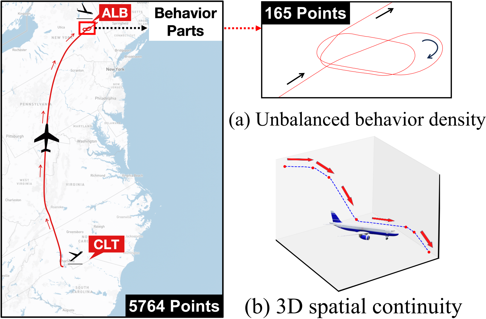
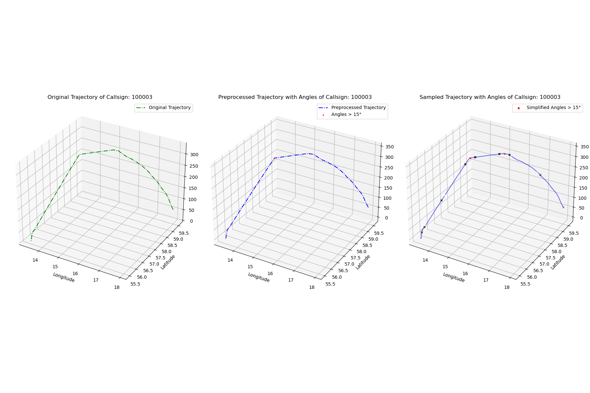

## Introduction
Flight2Vec is a flight-specific representation learning method to address two challenges, \ie, unbalanced behavior density and 3D spatial continuity

<p align="center">

</p>

- It consists of two key modules: (1)Behavior-Adaptive Patching Transformer and (2)Motion Trend Learning.

## Requirements
- networkx==3.2.1
- numpy==1.26.3
- PyYAML==6.0.1
- scikit-learn==1.4.0
- scipy==1.12.0
- torch==2.0.1
- torch_geometric==2.4.0
- torchaudio==2.0.2
- torchdata==0.7.1
- torchtext==0.17.0
- torchvision==0.15.2
- tqdm==4.66.1
- transformers==4.37.2
- urllib3==1.26.13

To install all dependencies:
```
pip install -r requirements.txt
```

### Download Data
Due to the file size limit, we put the data on other sites. Please first download the data and put it in `data` folder. The ATMFTraj dataset can be download at:  [here](https://huggingface.co/datasets/petchthwr/ATFMTraj), the SCAT dataset can be download at: [here](https://data.mendeley.com/datasets/8yn985bwz5/1)

### Data Processing 



### Training & Evaluating

To train Flight, run the following command:
```bash
python pretrain.py
```
You can finetune Flight2Vec by:
```bash
python finetune.py
```
